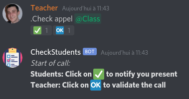
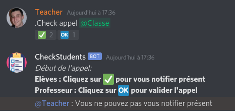
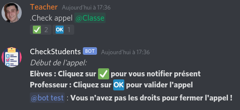
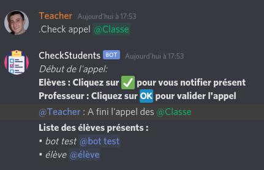

# CheckStudents
To add this bot to your Discord Server :

[Click Here](https://bit.ly/3mI4tWI)

>**Note : You need the corresponding privileges to add the bot on a server.**

## How it works ?

To see the students present in a course, a teacher (or any other user with an authorized role : See `addRole` command)

>To start a call, `.Check appel @class` (appel mean call in french)

>Emojis will appear below your message, the students belonging to the `@class` role would be able to click on the ✅ to notify their presence.
The teacher, or anyone with privileges, can end the call by clicking 🆗.

>Note : Users can only notify their presence if they are part of the group (External students will not be counted)
>Also, someone who does not have privileges cannot close the call.

>Once the call is finished, the bot will return the list of students present (will output the students not present in an update).

## Add/Remove privileges from a role

>Only a user with privileges can add/remove roles.
* Add : `.Check addRole @role1 @role2,...` 
* Remove : `.Check rmRole @role1 @role2,...`
>Note: You can add / remove as many roles as you want at the same time.

Note that the admin rights will not be checked if no admin has been registered beforehand.

**To see the list of admins,** write in the chat `.Check ListRoles`

## Translation

You can also use the bot in different languages (French,English,German only for the moment)
Use `.Check language {fr|en|de}`. The language is applied to all the server.
If you want to add another language, please check json prototypes and pull-request your translation !

## Data pravicy

The bot communicates with the server every time you use it. We only keep IDs guilds, roles with privileges, and just during a call, guilds usernames and theirs users IDs.

We also analyse every discord reaction on every servers to see if it correspond to a call message.

Icons made by [Freepik](http://www.freepik.com/) from [Flaticon](https://www.flaticon.com/)
