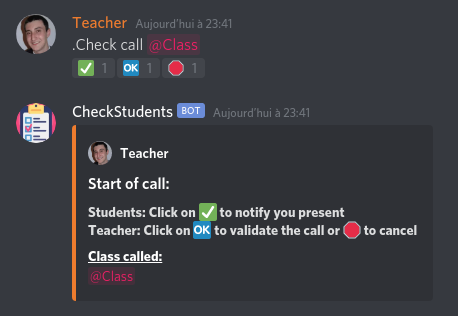
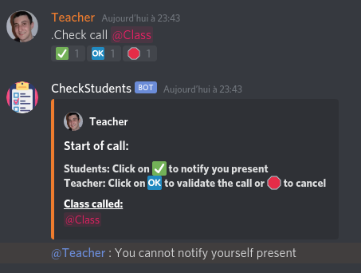
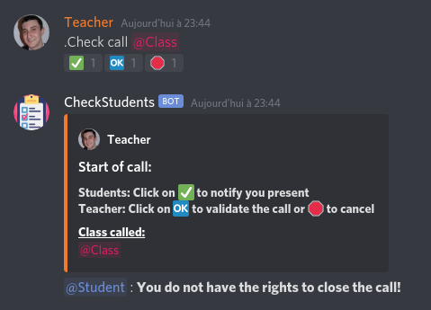
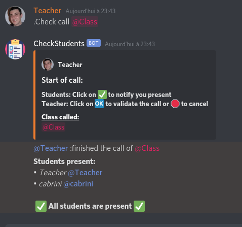
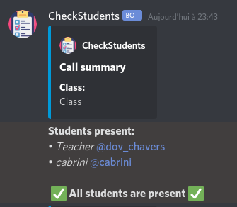
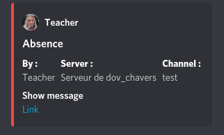

# CheckStudents

## Installation
To add this bot to your Discord Server :

**Please accept all permissions, or the bot will not respond on your server. Please refer to [this issue](#the-bot-doesnt-respond-to-any-command).**
>**Note : You need the corresponding privileges to add the bot on a server.**

### Read [CHANGELOG](CHANGELOG.md) here.
## How it works ?

For make a call, a teacher (or any other user with an authorized role): `call @class`.
> By default, if you did not change bot prefix, the command will be `.Check call @class`.
> Please refer to [prefix page](#change-bot-prefix) for more information.

Emojis will appear below your message, the students belonging to the `@class` role would be able to click on the ✅ to notify their presence.
The teacher, or anyone with privileges, can end the call by clicking 🆗 or cancel with 🛑.

Note : Users can only notify their presence if they are part of the group (External students will not be counted)
Also, someone who does not have privileges cannot close the call.

Once the call is finished, the bot will return the list of present and missing students and send the list to the teacher in private message.

The teacher who started the call will get a copy of the call in private message:

Every absent student will get an absence notification in private message, like this:

## Add/Remove privileges to a role

>Only a user with admin privileges can add/remove roles.

* Teacher:
    * Add: `teacher add @role1 @role2,...` 
    * Remove: `teacher remove @role1 @role2,...`
* Admin:
    * Add: `admin add @role1 @role2,...` 
    * Remove: `admin remove @role1 @role2,...`
>Note: You can add / remove as many roles as you want at the same time.

Note that the admin rights will not be checked if no admin has been registered beforehand.

**To see the list of admins or teachers, use command `admin list` or `teacher list`**

## Other commands
### Change bot prefix
If you want to change bot prefix, use command `admin prefix` followed by the new prefix. Default prefix is "`.Check `"
>You still can use `.Check ` even if you changed the prefix.
> 
>You must be an admin in order to execute this command.
### Translation

You can also use the bot in different languages (French, English and German only for the moment)
The language is applied to the whole server.
If you want to add another language, please check the [json prototype](language/en.json)  and pull-request your translation!
>You must be an admin in order to execute this command
> 
> Command : `admin language fr|en|de`
### Activate/Deactivate bot system messages
If you have a system messages on your server and wants the bot to send a message when someone has changed bot settings, you can activate this functionality. This functionality is activated by default.
>You must be an admin in order to execute this command
> 
> Command : `admin sys`

### Activate/Deactivate bot private messages
When a student is marked absent, he will receive 
This functionality is activated by default.
>You must be an admin in order to execute this command
> 
> Command : `admin DeactivateMP`

### Reset the bot
Reset command will reset admin list, put default prefix (`.Check`), activate bot private and system messages,  and set language to english.
>You must be an admin, **or the server owner** in order to execute this command
> 
> Command : `admin reset`

### Get current settings
Return language, and private and system messages status values.
> Command : `admin settings`

## Common Errors
### The bot doesn't respond to any command
>If the bot doesn't respond to any command, it might be because you did not accept all permissions. In that case, remove the bot from the server, and invite him again.

### Any other issue
> Please read [CHANGELOG](CHANGELOG.md) or create an issue.

## Data privacy

The bot communicates with the server every time you use it. We only keep IDs guilds, roles with privileges, and just during a call, guilds usernames and their users IDs.

We also analyse every discord reaction on every servers to see if it corresponds to a call message.
##### This repository use [Discord.py](https://github.com/Rapptz/discord.py) library from [Rapptz](https://github.com/Rapptz)
###### Icons made by [Freepik](http://www.freepik.com/) from [Flaticon](https://www.flaticon.com/)